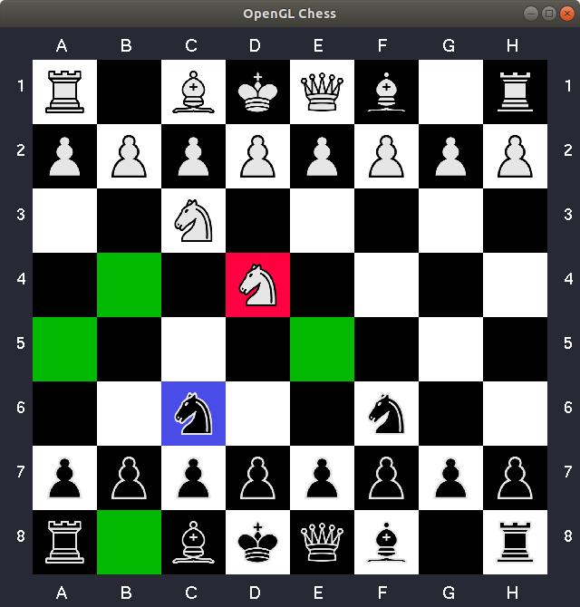

# Simple OpenGL Chess

## How to play
> IMPORTANT: The white pieces will always do the first move. You can change that bu setting the variable `DEFAULT_WHITE_START` to `false` in `main.cpp` file.

To move a piece, you can either use your mouse or keyboard. For select a piece with your mouse, just left-click the board square where it is. For select a piece with your keyboard, first, you need to provide a coordinate. A coordinate is generated when you press a letter (A-H, case insensitive) followed by a number (1-8).

Once a piece is selected, the board square where it is will glow **blue**. The board square where it can be moved will glow **green** or **red**, green means a free board square and red means a board square with a enemy (See image bellow). Moving into a enemy means capture it.

The game ends when the enemy's king is captured. When this happens, the following window will show up:

## Compiling and Running

Compile the program:
- **Linux**: `bash compile.sh`

Run the game:
- **Linux**: `./build.o`