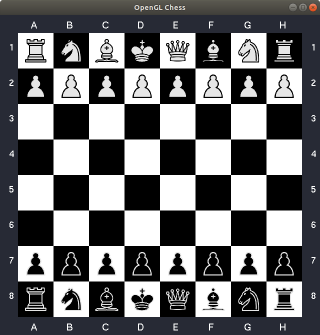
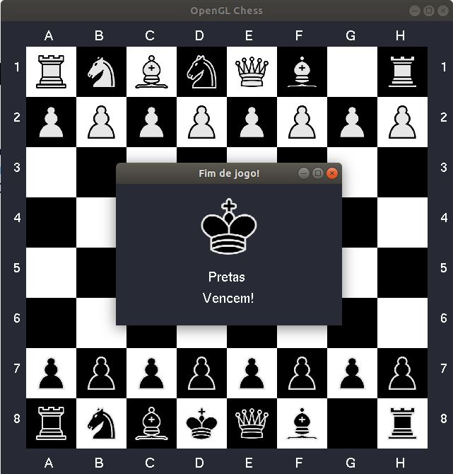

# Simple OpenGL Chess

## Como jogar
> IMPORTANTE: As peças brancas sempre começam o jogo. É possível alterar essa configuração alterando a variável `DEFAULT_WHITE_START` para `false` no arquivo `main.cpp`.

Para mover uma peça, você pode utilizar tanto seu mouse quanto seu teclado. Para selecionar uma peça com seu mouse, apenas clique com o botão esquerdo sobre a posição do tabuleiro em que a peça se encontra. Para selecionar uma peça com seu teclado você precisa fornecer uma coordenada. Uma coordenada é gerada quando você preciona uma letra (A-H, maiúscula ou não) seguida de um número (1-8).

Quando uma peça é selecionada, a posição do tabuleiro em que ela se encontra irá bilhar **azul**. As posições em que ela pode se mover irão bilhar **verde** ou **vermelho**. Verde significa que não existe uma peça inimiga naquela posição, vermelhor indica que há (Veja a imagem abaixo). Se movimentar a uma posição em que há um inimigo significa capturá-lo.

O jogo termina quando o rei inimigo é capturado. Quando isso acontece, a seguinte tela é exibida:

## Compilação e Execução

Compilar o programa:
- **Linux**: `bash compile.sh`

Execução do programa:
- **Linux**: `./build.o`